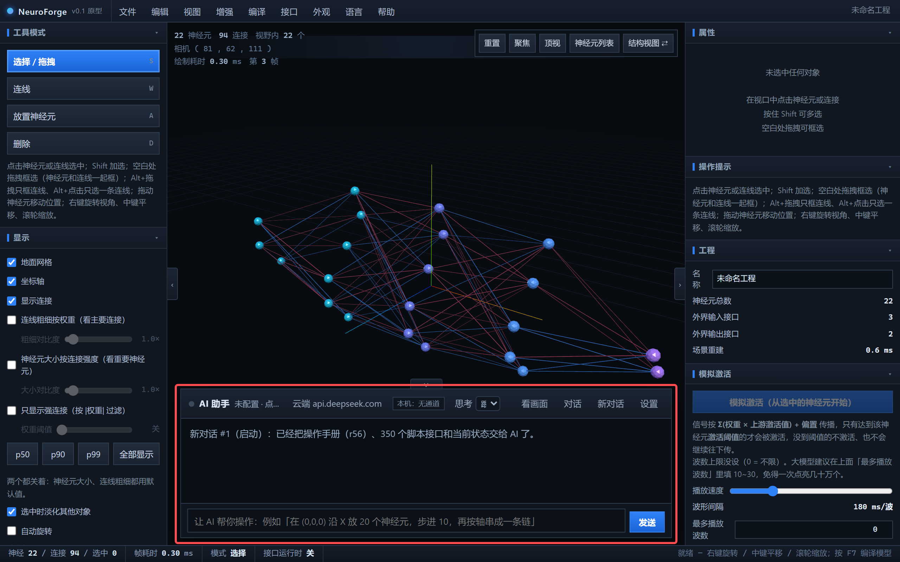
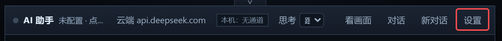
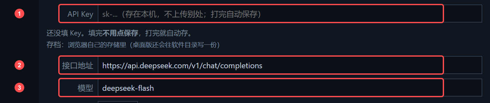
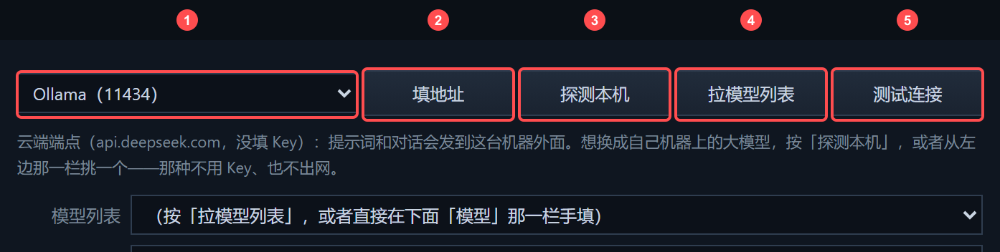
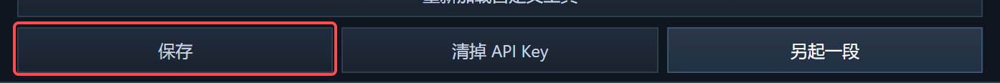
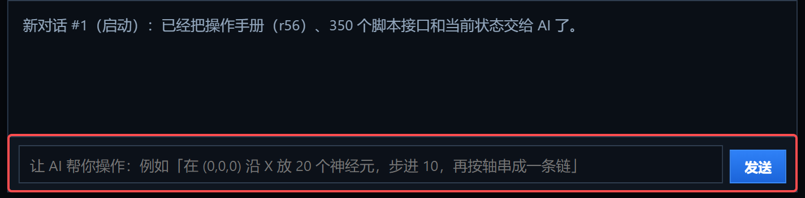

# 配好 AI 才算装上

NeuroForge 的 AI 助手不是聊天框旁边挂的装饰——**你绝大部分操作都是直接跟它说人话**。
接口配好之后，你不需要学代码，也不需要背快捷键。

## 先挑一条路

|  | 路线 A · 云端 API | 路线 B · 本机模型 |
| --- | --- | --- |
| 要装什么 | 不用装，注册一下拿到 Key | 装 Ollama（或 LM Studio 等） |
| 花钱 | 按量计费，很便宜 | 免费 |
| 联网 | 要 | 不要 |
| 数据 | 提示词和对话会发到服务商 | 不出本机 |
| 适合 | 想两分钟就用上 | 不想花钱 / 机器够用 |

**第一次用建议走 A**，两分钟能跑起来；用顺了再换 B。

## 第 0 步 · 打开设置

软件右下角那块就是 AI 助手。第一次打开它是这个样子：**「未配置 · 点「设置」填 API Key」**。

点最右边的 **设置**。

## 路线 A · 云端 API（实际只要填一个框）

DeepSeek 的地址和模型名软件已经帮你填好了，你要补的其实只有第 1 项：

1. **API Key** —— 去 [platform.deepseek.com](https://platform.deepseek.com) 注册，在 API Keys 里建一个，
   形如 `sk-xxxxxxxx`，粘进这一栏。Key 只存在你自己的机器上（网页版存在浏览器存储里，桌面版还会往软件目录再写一份），
   **不会上传到任何地方**。
2. **接口地址** —— 默认已经是 `https://api.deepseek.com/v1/chat/completions`，不用动。
3. **模型** —— 默认已经是 `deepseek-flash`。选它是因为**这个模型本身就能看图**，所以标题栏的
   「看画面」按钮直接可用，不用另配第二套端点。

> **填完不用点保存**，打完字就自动存了。

想换服务商也行：OpenAI、通义、Kimi、智谱……只要对方是 **OpenAI 兼容接口**，
把这三项换成对方的地址、模型名和 Key 就可以。

## 路线 B · 本机模型（不花钱、不出网）

1. 在最左边的下拉里选你装的服务 —— Ollama / LM Studio / llama.cpp 的 llama-server / vLLM /
   Xinference / KoboldCpp / text-generation-webui。
2. 按 **「填地址」**，它会把选中的服务地址填进「接口地址」，不用自己记端口。
3. 按 **「拉模型列表」**，从下拉里挑一个模型；也可以直接在「模型」那一栏手填。
4. 按 **「测试连接」** —— 它会真的发一句话过去，量一下多久回来、认不认工具调用参数。

> 本机端点**不用填 Key**，请求也不出公网。
>
> **网页版要注意跨域**：Ollama / LM Studio 默认不带跨域头，浏览器会把它拦下来，表现是
> 服务明明开着却报「连不上」。Ollama 设环境变量 `OLLAMA_ORIGINS=*` 再重启；
> LM Studio 在 Developer 里打开 CORS。**桌面版没有这个问题** —— 直连被拦时它会自动改从壳子发出去。
>
> 不知道该装哪个：装 **Ollama**，然后 `ollama pull qwen3:8b`。它自己就开在 11434，不用另起服务。

## 第 1 步 · 确认连上了

设置面板顶上有一行小字，会告诉你**当前请求到底出不出网**：

- 选云端时显示 `云端 api.deepseek.com`；还差 Key 会写明「没填 Key」。
- 选本机时显示 `本机/内网端点`，并注明**不用填 Key**。

标题栏那行也会从 **「未配置」** 变成你的服务商和模型。没变就是没连上。

接错了想重来，**「清掉 API Key」**会把本机存储、设置文件、备份三份一起清干净。

## 第 2 步 · 开始干活

在那个输入框里**直接说人话**，例如：

- 「在 (0,0,0) 沿 X 放 20 个神经元，步进 10，再按轴串成一条链」
- 「把这两组接成全连接」
- 「模拟激活跑一遍，看看信号从输入到输出走了几步」
- 「按 |权重| 的 p90 过滤一下，把弱的连线藏起来」
- 「编译成 PyTorch 代码」

软件内置了一百多个工具（放神经元、批量铺设、改权重、模拟激活、打包权重块、切相机、编译……），
工具没覆盖的还有兜底接口可以调。**每一次改动都是一步撤销** —— 不满意就 Ctrl+Z。

它要删东西、要铺几万个神经元的时候，会先弹一个框问你。要是嫌烦、经常让它连着干一串活，
可以在设置里把「大改动先问我」的勾去掉；勾着的时候那个框**没人点它会一直等下去**。

## 出问题怎么办

一句话：**直接问它。**

- 报错了 → 在对话框里说「刚才报错了，看看怎么回事」。它能读到自己收到的错误信息。
- 不知道某个按钮干什么 → 鼠标停上去有说明，或者直接问。
- Key 填错了 → 设置里「清掉 API Key」重填。

---

许可与反馈见 [README](../README.zh-CN.md)。微信号：`17798645729`